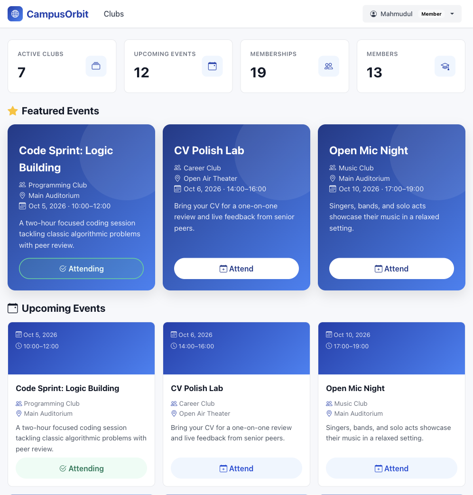
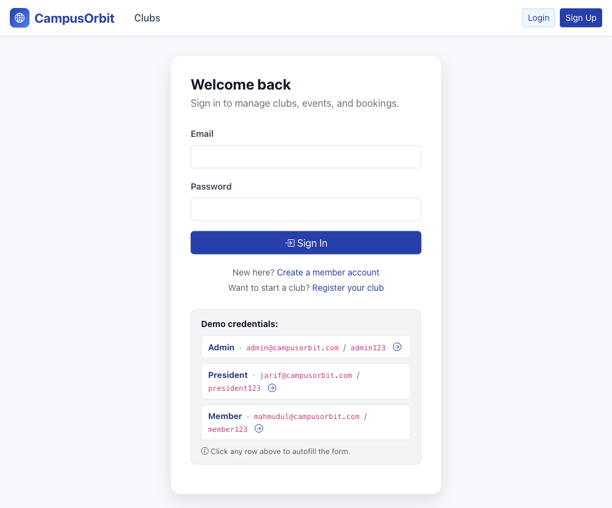
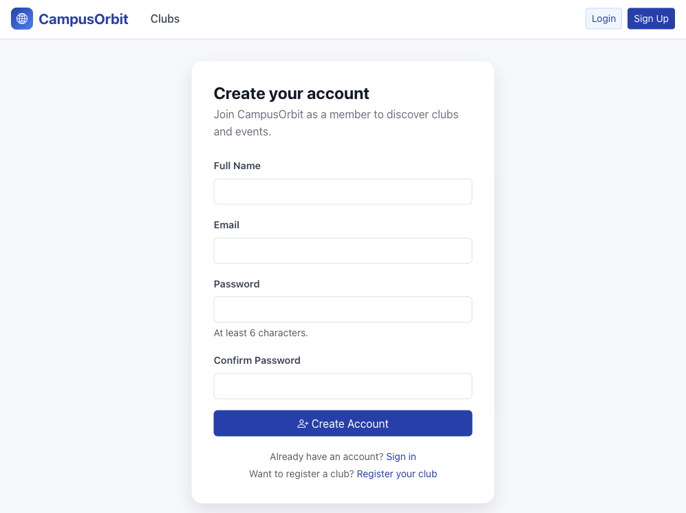
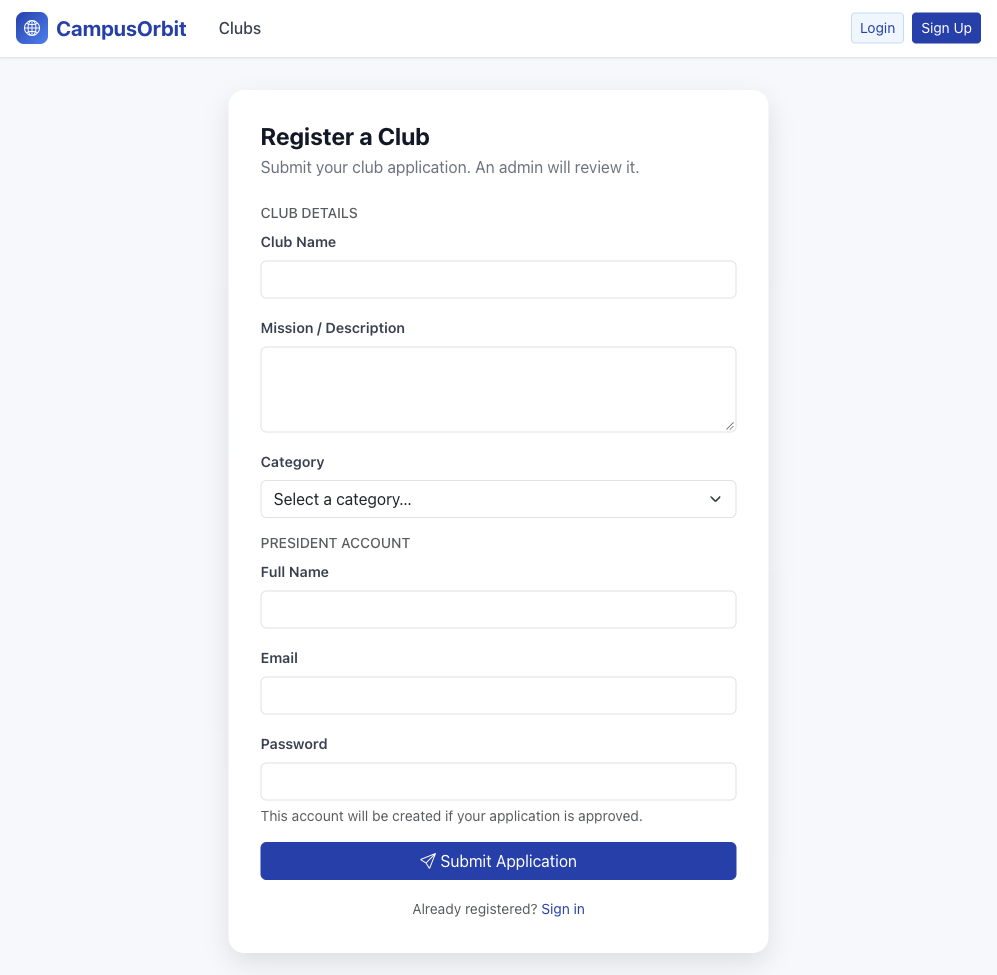
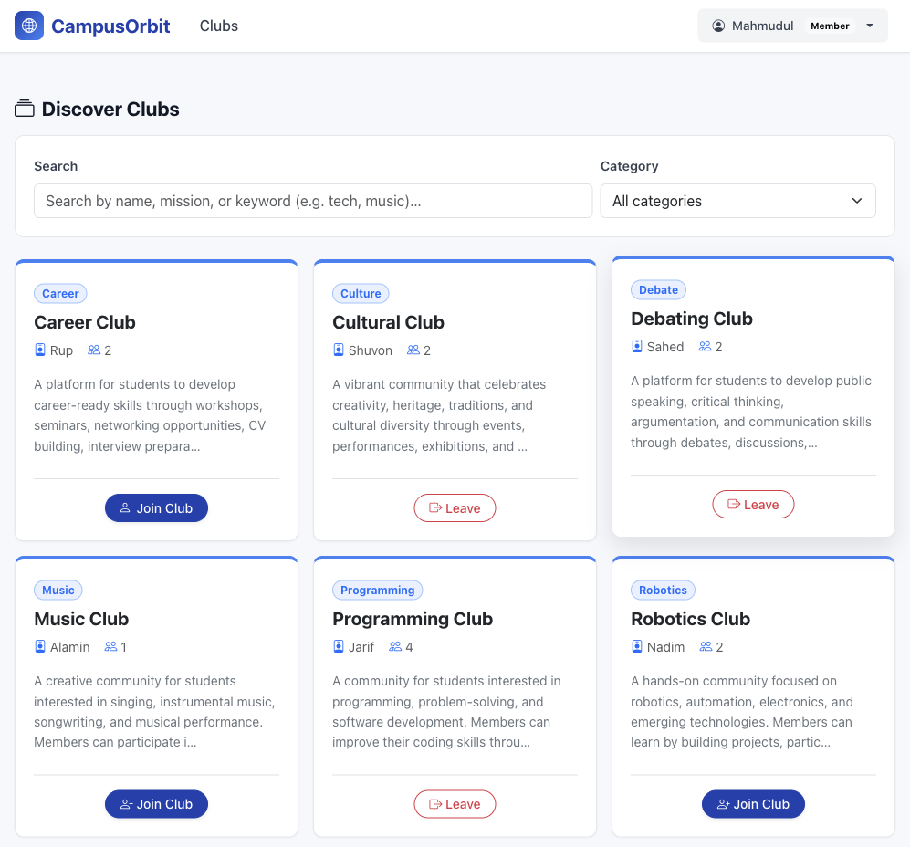
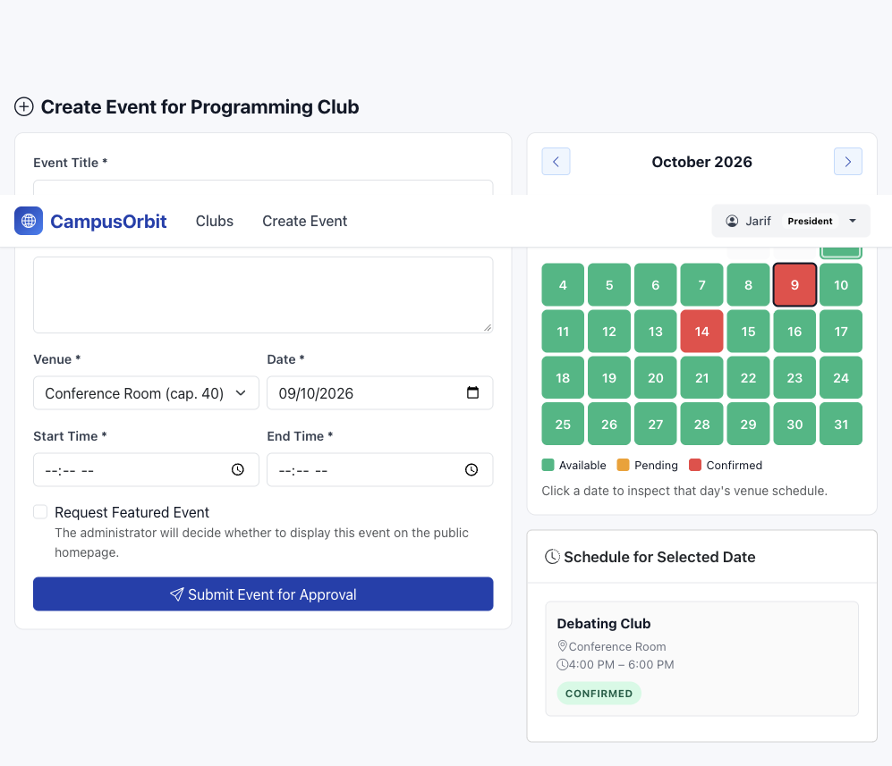
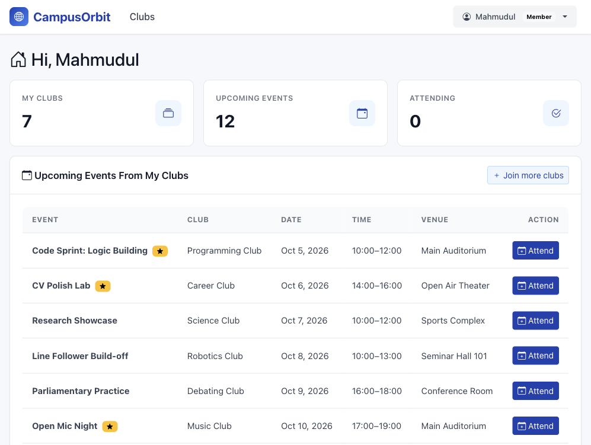
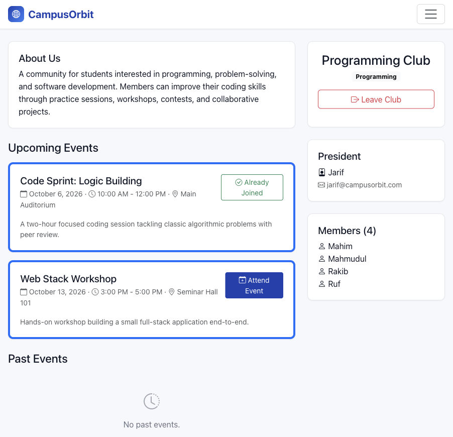
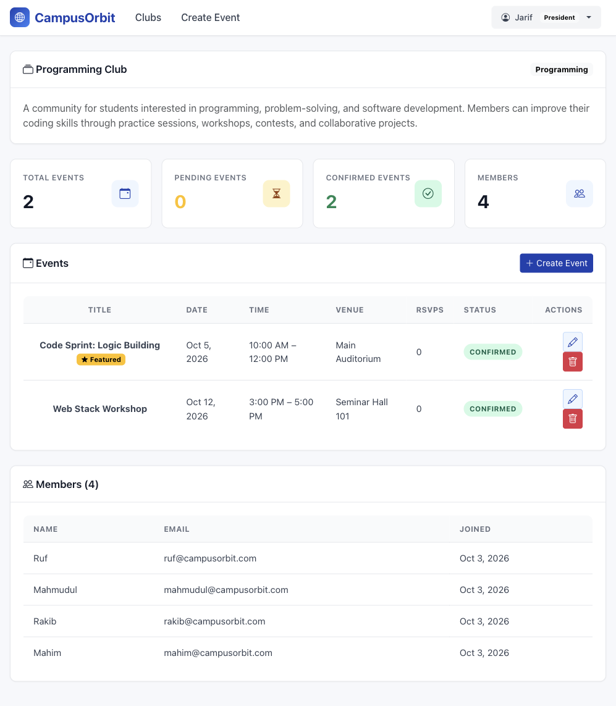
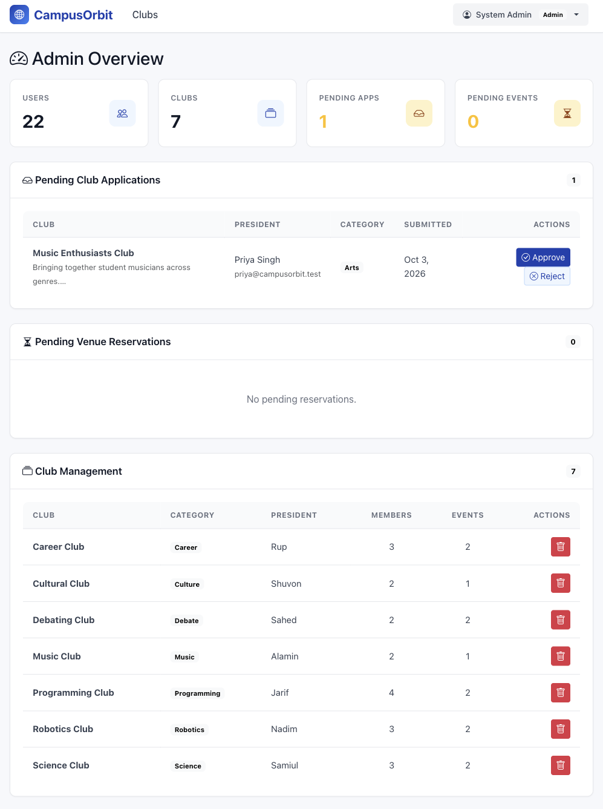

# CampusOrbit

> A complete full-stack web application for **University Club & Venue Management**.

CampusOrbit is a centralized hub for campus life: members discover and join clubs, attend events, and follow featured happenings; club presidents manage their organizations and book venues; administrators approve clubs, reservations, and manage the platform.

The project is built **from scratch** with native PHP, PostgreSQL, and Bootstrap — no frameworks.

---

## Screenshots

| | |
|---|---|
|  |  |
| **Home page** — Platform-wide stat tiles (Active Clubs, Upcoming Events, Memberships, Members), a Featured Events row, and a chronological Upcoming Events grid. Action buttons adapt to the viewer (Attending / Attend / Sign in to Join). | **Login page** — Clean auth screen with click-to-fill demo credentials for Admin, President, and Member. |
|  |  |
| **Member signup** — Create a member account with validation (full name, email, password, confirm). | **Register a club** — Submit a club application with mission, category, and the future president's account info. |
|  |  |
| **Discover Clubs** — Live search and category filter; the viewer's own club is pinned first. | **Create event** — Presidents book a venue with an interactive calendar showing Available / Pending / Confirmed days. |
|  |  |
| **Member dashboard** — Stats (My Clubs, Upcoming Events, Attending), upcoming events from the member's clubs, and one-click Attend actions. | **Club details** — Public club page with About Us, Upcoming Events, Members roster, and the President's contact info. |
|  |  |
| **President dashboard** — Stat tiles (Total / Pending / Confirmed events + Members), an events table with status and edit/delete controls, and the members roster. | **Admin dashboard** — Stat tiles (Users, Clubs, Pending Apps, Pending Events), pending club applications, pending venue reservations, and a full club management table. |

---

## Features

### Home & Discovery (no login required)
- **Platform stats tiles** — Active Clubs, Upcoming Events, Memberships, and Members counts at the top of the home page
- **Featured Events** — A curated row of highlighted upcoming events on the landing page, marked featured by administrators
- **All Upcoming Events** — Chronological grid of every confirmed upcoming event
- **Discover Clubs** — Live search combined with an independent category dropdown (OR semantics; results update as the user types)
- **Club Details** — Public club page with About Us, upcoming events, members roster, and the President's contact info
- **Register a Club** — Public application form that lands in the admin queue as a pending application
- **Member Registration & Login** — With click-to-fill demo credentials on the login screen

### Member
- Personalized dashboard showing events from clubs they belong to
- Attend / leave events (with backend membership verification)
- Join / leave clubs
- Recommended events from other clubs

### Club President
- Manage their club profile, members, and events
- Dashboard stat tiles (Total / Pending / Confirmed events + Members)
- Create events with venue booking
- Interactive calendar showing venue availability per date (Available / Pending / Confirmed)
- AJAX-powered schedule inspection (no page reload)
- Server-side conflict detection on overlapping bookings
- Cancel pending events
- Events start as `pending` until admin approves
- Logged-in president's own club is pinned to the top of the public club list

### Admin
- Admin overview stat tiles (Users, Clubs, Pending Apps, Pending Events)
- Review & approve / reject club applications (auto-provisions president account)
- Review & approve / reject venue reservations
- Manage users and assign elevated roles
- Delete clubs
- Platform-wide stats
- **Two-tier admin model**:
  - *Demo admin* (a fixed, well-known email) — read-only UI for all CRUD actions
  - *System admin* (any other admin email) — full CRUD on everything

### Cross-cutting
- Role-based event action buttons (`Sign in to Join`, `Join [Club] to Attend`, `Attend`, `Attending`, `Manage in Dashboard`, `Review in Dashboard`) for guests, members, presidents, and admins
- Pill-shaped buttons with consistent border treatment across the app
- Featured events highlight without an in-card "Featured" badge

---

## Technology Stack

| Layer    | Choice                                                              |
| -------- | ------------------------------------------------------------------- |
| Backend  | Native PHP (PHP 8+), PHP Sessions, PDO                              |
| Database | PostgreSQL (ENUMs, foreign keys, unique constraints, indexes)        |
| Frontend | HTML5, CSS3, Bootstrap 5, JavaScript (vanilla), AJAX / Fetch API    |

---

## Folder Structure

```
CampusOrbit/
├── assets/
│   ├── css/style.css
│   └── js/booking_ajax.js
├── config/
│   ├── db.php
│   └── session.php
├── components/
│   ├── header.php
│   ├── footer.php
│   ├── navbar.php
│   └── sidebar.php
├── actions/
│   ├── auth_handler.php
│   ├── club_handler.php
│   ├── event_handler.php
│   ├── fetch_calendar.php
│   └── fetch_slots.php
├── pages/
│   ├── index.php
│   ├── login.php
│   ├── register.php
│   ├── register_club.php
│   ├── club_list.php
│   ├── club_details.php
│   ├── dashboard_student.php
│   ├── dashboard_president.php
│   ├── dashboard_admin.php
│   ├── create_event.php
├── Screenshots/                   # README screenshots
├── database/
│   └── schema.sql
├── index.php
├── router.php
└── README.md
```

---

## PostgreSQL Setup

CampusOrbit expects a PostgreSQL database named **`CampusOrbit`** on **`localhost:5432`** with user **`postgres`** and **no password** (default Postgres.app local setup).

If your setup is different, set environment variables before launching PHP:

```bash
export PGHOST=localhost
export PGPORT=5432
export PGDATABASE=CampusOrbit
export PGUSER=postgres
export PGPASSWORD=yourpassword
```

### 1. Create the database

Open Postgres.app, then in a terminal:

```bash
createdb CampusOrbit
```

### 2. Create the schema

```bash
psql -d CampusOrbit -f database/schema.sql
```

---

## Run Locally

From the `CampusOrbit/` directory:

```bash
php -S localhost:8000 -t .
```

Then open <http://localhost:8000/>.

> The PHP server's `-t .` flag treats this `CampusOrbit/` folder as the web root.
> That means URLs are `/pages/index.php`, `/assets/css/style.css`, etc. — not
> `/CampusOrbit/pages/...`. Apache or nginx with `DocumentRoot` set to this
> directory will behave identically.

---

## User Roles & Routing

| Role      | Dashboard                       |
| ---------- | ------------------------------ |
| `admin`    | `pages/dashboard_admin.php`    |
| `president`| `pages/dashboard_president.php`|
| `student`  | `pages/dashboard_student.php`  |

Direct URL access is blocked server-side via `require_role()`.

After login or registration, members are redirected to the homepage, while admins and presidents are redirected to their respective dashboards.

---

## Admin Tiering: Demo Admin vs System Admin

CampusOrbit distinguishes between a **demo admin** (for evaluators) and a **system admin** (the real owner).

- The **demo admin** is identified by a fixed, well-known email. When signed in as the demo admin, the dashboard disables all CRUD actions (Approve/Reject applications, Approve/Reject venue reservations, Delete clubs, Change user roles) with explanatory banners and lock icons. Clicking any disabled control produces a toast explaining the restriction.
- The **system admin** is any other admin account. They see the full UI and can perform all CRUD operations.

The check is a single line in `pages/dashboard_admin.php`:

```php
$isSystemAdmin = ($viewerEmail !== '<demo-admin-email>');
```

---

## Workflows

### Club Registration & Approval

```
Prospective Club  →  /pages/register_club.php
            ↓
        club_applications (status = pending)
            ↓
Admin reviews → /pages/dashboard_admin.php
            ↓
    ┌───────┴────────┐
    │                │
Approve          Reject
    ↓                ↓
Create user (president)
Create clubs row, link president
Mark application approved
```

### Venue Reservation

```
President → Create Event
        ↓
Select venue + date on calendar
        ↓
Inspect that day's schedule (AJAX)
        ↓
Submit start/end time
        ↓
Server: BEGIN TRANSACTION
        Check conflicts (overlap with pending/confirmed)
        No conflict?  → INSERT event (status = pending) → COMMIT
        Conflict?     → ROLLBACK + 409 message
        ↓
Admin reviews → /pages/dashboard_admin.php
        ↓
Approve → status = confirmed  (now bookable from public)
Reject  → status = rejected
```

### Attending an Event

```
Member clicks the event action button
        ↓
Authenticated?           No → "Sign in to Join" (links to login)
        ↓ Yes
Already attending?       Yes → "Attending" (green pill, disabled)
        ↓ No
Member of host club?     No → "Join [Club] to Attend" (opens join flow)
        ↓ Yes
INSERT event_attendees (UNIQUE(event_id,user_id))
        ↓
Button switches to "Attending"
```

The same role-aware logic also drives buttons seen by presidents (`Manage in Dashboard`) and admins (`Review in Dashboard`) so the home page works for every role.

---

## Responsive Design

The application is fully responsive at:

```
1440px, 1280px, 1024px, 768px, 480px, 360px
```

- Bootstrap 5 grid + custom CSS
- Mobile-friendly sidebar (wraps on small screens)
- Responsive calendar (smaller cells, no horizontal scroll)
- Responsive tables (`table-responsive`)
- Navbar width matched to the content section

---

## Testing — Suggested Manual Checks

### Authentication
- Register a new member
- Login as admin / president / member
- Visit a wrong-role dashboard → 403
- Logout and verify session destroyed
- Click any demo credentials row on the login page → form auto-fills

### Clubs
- Submit a new club application via `/pages/register_club.php`
- Admin approves → president can log in and see their dashboard
- Member joins a club twice → second attempt blocked
- Search and category filter on `/pages/club_list.php` — independent, OR-combined, e-commerce-style live filtering
- Logged-in president's club appears first in `/pages/club_list.php`

### Events
- President creates an event for tomorrow 10–11
- Admin approves → member attends
- Another president creates 10:30–11:30 → rejected (overlap)
- Create 11–12 → OK (adjacent, no overlap)

### Attending
- Non-member clicks Attend → join modal
- Member attends twice → blocked
- Unauthenticated user → "Sign in to Join" button

### Admin Tiering
- Sign in as the demo admin → every CRUD action shows lock icons + info banner
- Sign in as the system admin → full CRUD buttons render

---

© 2026 Mahmudul Islam Amit (ID: IT 23008)